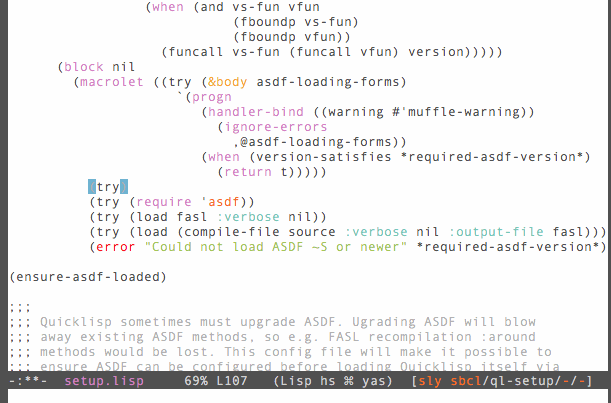

[](http://melpa.org/#/sly-macrostep)
[](https://travis-ci.org/capitaomorte/sly-macrostep)

# [`macrostep`][1] support for SLY

`sly-macrostep` is a [SLY][sly] contrib for expanding CL macros right
inside the source file, like so:



This extension is the work of [Jon Oddie](github.com/joddie), the
original author of the excellent [`macrostep.el`][1] library, and
[Luís Oliveira](github.com/luismbo).

I just ported it to SLY with some minimal renaming and tweaks.

## Install from MELPA

*MELPA availability is still pending at the moment, but should 
become active soon*

Perform the [usual MELPA setup](http://melpa.org) and then select
`sly-macrostep` for installation from the package menu or from `M-x
package-install`.

Once it's done, `M-x sly` should now bring up a macrostep-enabled
SLY.

In `.lisp` files you can now use `C-c M-e` or `M-x macrostep-expand`
to expand a macro.

## Melpa-less install

Since this is an external contrib with both Elisp and Lisp parts,
merely loading the Elisp will have little effect. The contrib has to
be registered in SLY's `sly-contribs` variable for SLY to take care of
loading the Lisp side on demand.

For convenience, the `sly-macrostep-autoloads` file takes care
of this automatically. So the following setup in your `~/.emacs` or
`~/.emacs.d/init/el` init file should be enough:

```elisp
;;; regular SLY setup
(setq inferior-lisp-program "/path/to/your/preferred/lisp")
(add-to-list 'load-path "/path/to/sly")
(require 'sly-autoloads)

(add-to-list 'load-path "/path/to/sly-macrostep")
(require 'sly-macrostep-autoloads)
```

In case you already have SLY loaded and running, you might have to
`M-x sly-setup` and `M-x sly-enable-contrib` to enable it.


[1]: https://github.com/joddie/macrostep
[sly]: https://github.com/capitaomorte/sly


